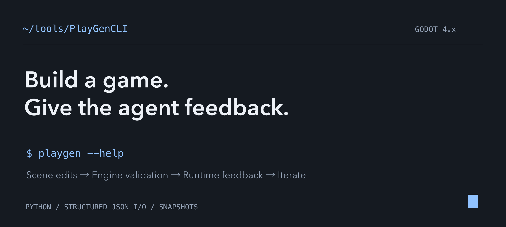
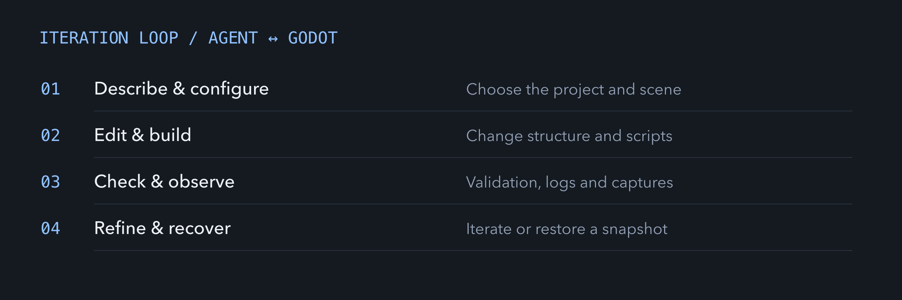
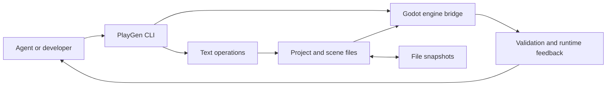

<p align="center"><strong>English</strong> · <a href="README.zh-CN.md">简体中文</a></p>
<p align="center"><a href="#quick-start">Quick start</a> · <a href="AGENT_GUIDE.md">Agent guide</a> · <a href="README.reference.md#commands">Command reference</a> · <a href="README.reference.md#changelog">Changelog</a></p>

# Give your agent a way to build and inspect a game

PlayGenCLI is a Python command-line tool for Godot 4.x. It lets an agent create scenes, connect assets, edit scripts, configure a project, and inspect the result through structured JSON output.

The feedback loop includes engine validation, runtime observations, and viewport capture. File snapshots provide a recovery point when an iteration goes wrong.



## The tools behind an iteration

| Task | Commands | Result |
| --- | --- | --- |
| Create a project | `init`, `build` | A Godot project and scene files. |
| Change the scene | `scene`, `node`, `script`, `signal` | Structured edits to the scene and its behavior. |
| Add creative assets | `asset`, `resource`, `animation` | Images, audio, fonts, resources, and animation. |
| Check the result | `analyze`, `bridge`, `run` | Project structure, engine checks, and runtime feedback. |
| Recover an iteration | `snapshot save`, `snapshot restore` | File-based project snapshots. |

## Two layers of execution



Text operations can edit a project without launching Godot. Engine validation, runtime observation, and screenshots require a local Godot installation. Engine feedback helps inspect an iteration; it does not establish the quality of the game design.

## Quick start

Use **Python 3.10+**. Install **Godot 4.x** for the engine-backed commands, and add it to `PATH` or set `GODOT_PATH`.

```bash
git clone https://github.com/LuvElixir/playgen-cli.git
cd playgen-cli
python3 -m venv .venv
source .venv/bin/activate
python -m pip install -e .

mkdir -p ../playgen-demo
playgen --project ../playgen-demo init --template 2d-platformer
playgen --project ../playgen-demo analyze --json-output
playgen --project ../playgen-demo run --observe --timeout 10
```

On Windows, activate the environment with `.venv\Scripts\Activate.ps1` in PowerShell. The final command runs the generated project with Godot and collects runtime observations.

## Build a scene from JSON

Save this as `scene.json` inside the demo project.

```json
{
  "scene": "main.tscn",
  "root": {
    "name": "Main",
    "type": "Node2D",
    "children": [
      { "name": "Greeting", "type": "Label", "text": "Hello from PlayGen" }
    ]
  }
}
```

```bash
cd ../playgen-demo
playgen build scene.json --snapshot before-build --validate --json-output
playgen run --screenshot 60 --timeout 10
```

The example illustrates the input format. See the [agent guide](AGENT_GUIDE.md) for the full schema, asset shorthands, and recommended iteration steps.

## Development and scope

```bash
python -m pip install -e '.[test]'
python -m pytest
```

The package metadata currently declares **0.7.0**. The code targets Godot 4.x; it is a prototype-building tool with explicit engine dependencies. Check engine-backed commands against the Godot version used by your project.

The repository currently has no standalone open-source license file. Public availability should not be read as an unrestricted reuse license.

<p align="center">Built by <a href="https://github.com/LuvElixir">LuvElixir</a> · <a href="https://luckyloading.com/">Luckyloading</a></p>
