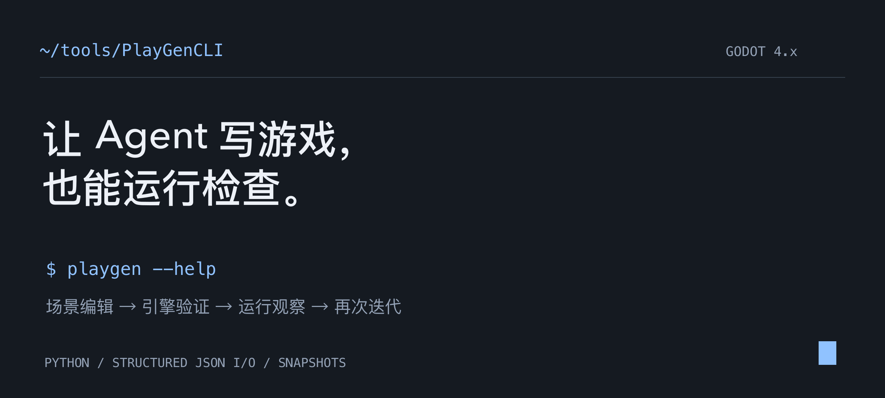
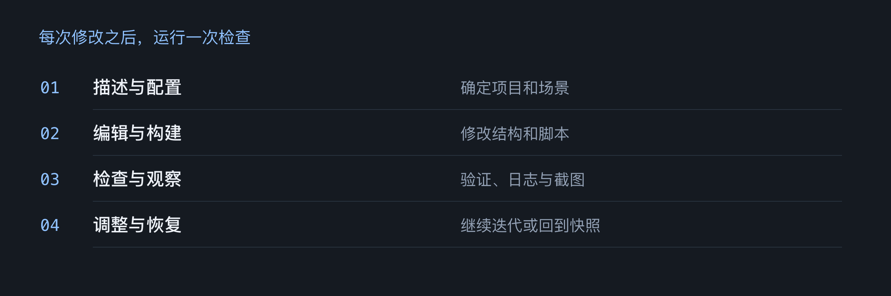
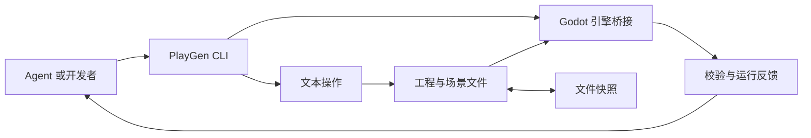

<p align="center"><a href="README.md">English</a> · <strong>简体中文</strong></p>
<p align="center"><a href="#快速开始">快速开始</a> · <a href="AGENT_GUIDE.md">Agent 指南</a> · <a href="README.reference.md#commands">命令参考</a> · <a href="README.reference.md#changelog">更新记录</a></p>

# Agent 改完 Godot 工程，可以直接运行检查

PlayGenCLI 给 Agent 提供了一组操作 Godot 4.x 工程的命令。创建场景、修改脚本、配置素材后，Agent 可以启动引擎，读取运行记录和截图，再决定下一步怎么改。命令结果通过 JSON 返回。

修改前可以保存文件快照。如果这一轮改坏了，就恢复快照，重新尝试。



## 从搭建工程到运行检查

| 任务 | 命令 | 结果 |
| --- | --- | --- |
| 创建工程 | `init`、`build` | Godot 工程与场景文件。 |
| 调整场景 | `scene`、`node`、`script`、`signal` | 修改场景中的节点、脚本与信号连接。 |
| 接入创作素材 | `asset`、`resource`、`animation` | 图片、声音、字体、资源与动画。 |
| 检查结果 | `analyze`、`bridge`、`run` | 工程结构、引擎校验与运行反馈。 |
| 恢复修改 | `snapshot save`、`snapshot restore` | 基于文件的工程快照。 |

## 两层执行方式



文本操作可以直接编辑工程。引擎校验、运行观察与截图需要本机安装 Godot。这些反馈能帮助检查工程有没有运行起来。游戏是否好玩，还得实际试玩。

## 快速开始

准备 **Python 3.10+**。需要引擎能力时，安装 **Godot 4.x** 并加入 `PATH`，或配置 `GODOT_PATH`。

```bash
git clone https://github.com/LuvElixir/PlayGenCLI.git
cd PlayGenCLI
python3 -m venv .venv
source .venv/bin/activate
python -m pip install -e .

mkdir -p ../playgen-demo
playgen --project ../playgen-demo init --template 2d-platformer
playgen --project ../playgen-demo analyze --json-output
playgen --project ../playgen-demo run --observe --timeout 10
```

Windows 可在 PowerShell 中使用 `.venv\Scripts\Activate.ps1` 激活环境。最后一条命令会通过 Godot 运行生成的工程，并收集运行记录。

## 用 JSON 搭一个场景

把下面的内容保存为演示工程里的 `scene.json`。

```json
{
  "scene": "main.tscn",
  "root": {
    "name": "Main",
    "type": "Node2D",
    "children": [
      { "name": "Greeting", "type": "Label", "text": "Hello from PlayGen" }
    ]
  }
}
```

```bash
cd ../playgen-demo
playgen build scene.json --snapshot before-build --validate --json-output
playgen run --screenshot 60 --timeout 10
```

示例用于说明输入格式。完整字段、素材简写与迭代步骤见 [Agent 指南](AGENT_GUIDE.md)。

## 开发与适用范围

```bash
python -m pip install -e '.[test]'
python -m pytest
```

当前包元数据版本为 **0.7.0**。项目面向 Godot 4.x 的原型搭建，部分能力依赖本机引擎。依赖引擎的命令需要在项目所用的 Godot 版本上验证。

仓库目前没有独立的开源许可证文件。公开可见不代表已授予无限制的复用许可。

<p align="center"><a href="https://github.com/LuvElixir">LuvElixir</a> 制作 · <a href="https://luckyloading.com/">Luckyloading</a></p>
